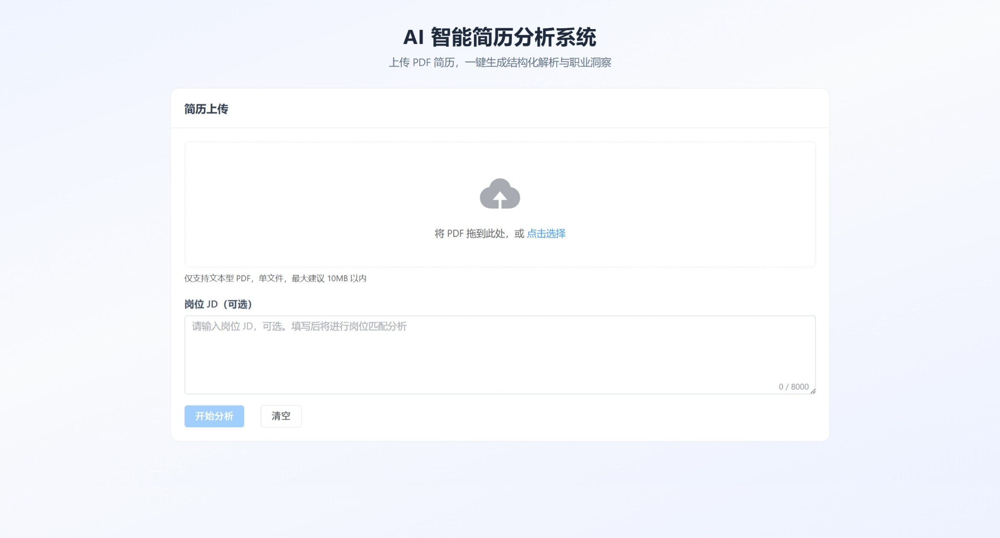
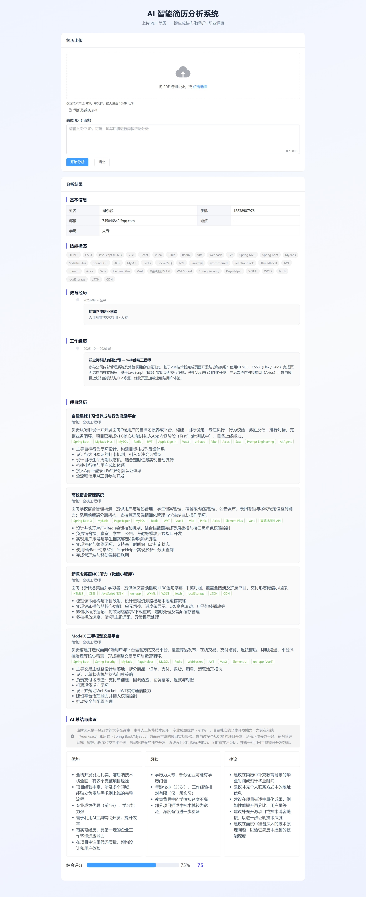

# AI 智能简历分析系统

面向笔试与工程演示的全栈 MVP：上传 PDF 简历，后端解析文本并调用 **OpenAI 兼容 API**（如 DeepSeek、OpenAI）完成结构化抽取；可选粘贴岗位 JD，输出岗位匹配分析；未配置密钥或模型异常时自动 **Mock / 规则降级**，保证可本地完整跑通。

---

## 项目简介

系统由 **FastAPI 后端** 与 **Vue 3 + Vite 前端** 组成。用户通过浏览器上传简历 PDF，可选填写 JD，获得结构化的基本信息、教育、技能、工作/项目经历、综合点评，以及在填写 JD 时的匹配分数与建议。接口采用统一 JSON 信封，便于联调与自动化测试。

---

## 核心功能

| 能力                     | 说明                                                                                         |
| ------------------------ | -------------------------------------------------------------------------------------------- |
| **PDF 简历上传**         | `multipart/form-data` 上传，校验扩展名与 MIME，限制单文件大小（可配置）                      |
| **PDF 文本解析**         | PyMuPDF 提取文本，清洗空白并截断长度，避免超大请求                                           |
| **AI 结构化简历分析**    | 大模型严格 JSON 输出，Pydantic 校验与补全；失败回退演示数据                                  |
| **JD 岗位匹配分析**      | 可选 `jd_text`；有密钥时优先大模型语义匹配，失败或无密钥时用本地关键词规则                   |
| **Mock / fallback 降级** | 无 `AI_API_KEY` 时简历与匹配均可演示；请求失败、非 JSON、弱结果时逐级降级                    |
| **前端可视化展示**       | Element Plus：上传区、JD 文本域、简历卡片、岗位匹配模块、状态标签（离线演示 / 大模型失败等） |

---

## 技术栈

| 端       | 技术                                                                                  |
| -------- | ------------------------------------------------------------------------------------- |
| **前端** | Vue 3、Vite、Element Plus、Axios                                                      |
| **后端** | FastAPI、Uvicorn、Pydantic、PyMuPDF（`fitz`）、python-dotenv、requests                |
| **AI**   | DeepSeek / OpenAI 等 **OpenAI-compatible** Chat Completions（`/v1/chat/completions`） |

---

## 项目架构目录

```
resume-ai-analyzer/
├── README.md                 # 本文件：总览与快速开始
├── docs/
│   ├── API.md                # HTTP API 说明与示例
│   └── SUBMISSION.md         # 面试/评审提交说明
├── backend/
│   ├── app/
│   │   ├── main.py           # FastAPI 入口、CORS
│   │   ├── config.py         # 环境变量与运行参数
│   │   ├── models/           # Pydantic 简历与匹配 schema
│   │   ├── services/         # PDF / AI / 岗位匹配
│   │   └── routers/          # 健康检查、简历分析路由
│   ├── requirements.txt
│   ├── .env.example
│   └── README.md
└── frontend/
    ├── src/
    │   ├── api/resume.js     # 统一封装 /api 请求
    │   ├── views/ResumeAnalyzer.vue
    │   ├── App.vue
    │   └── main.js
    ├── vite.config.js        # 开发代理 /api → 后端
    ├── package.json
    └── README.md
```

---

## 系统流程说明

```
用户上传 PDF + 可选 JD
        ↓
后端校验类型与文件大小 → 读取字节流
        ↓
PyMuPDF 解析 PDF → 文本清洗与长度限制
        ↓
调用 AI（或 Mock）→ 简历结构化 JSON
        ↓
若 jd_text 非空 → AI 或本地规则 → match_analysis
        ↓
统一信封 { code, message, data } → 前端展示
```

---

## API 文档

详细字段、示例见 **[docs/API.md](./docs/API.md)**。交互式文档：启动后端后访问 **<http://127.0.0.1:8000/docs**。>

| 方法   | 路径                  | 说明                     |
| ------ | --------------------- | ------------------------ |
| `GET`  | `/api/health`         | 健康检查                 |
| `POST` | `/api/resume/analyze` | 上传 PDF，可选 `jd_text` |

**统一成功响应：**

```json
{
  "code": 0,
  "message": "success",
  "data": {}
}
```

**统一错误响应：**

```json
{
  "code": 1,
  "message": "错误原因说明",
  "data": null
}
```

`POST /api/resume/analyze` 使用 `multipart/form-data`：

- **`file`**（必填）：PDF 文件。
- **`jd_text`**（选填）：岗位 JD 纯文本；仅空白则视为未提供，不返回 `match_analysis`。

---

## 环境变量说明

在 `backend` 目录复制 `.env.example` 为 `.env` 后配置：

| 变量                     | 说明                                                                    |
| ------------------------ | ----------------------------------------------------------------------- |
| `AI_API_KEY`             | 大模型 API Key；**留空**则简历与（无额外逻辑时）匹配走本地演示/规则     |
| `AI_BASE_URL`            | 兼容接口根 URL，需含 `/v1` 路径前缀（如 `https://api.deepseek.com/v1`） |
| `AI_MODEL`               | 模型名，如 `deepseek-chat`、`gpt-4o-mini`                               |
| `MAX_RESUME_TEXT_LENGTH` | PDF 提取文本最大字符数，默认 `15000`                                    |
| `MAX_UPLOAD_FILE_MB`     | 单文件上传上限（MB），默认 `10`                                         |

**注意：** 勿将真实密钥提交到 Git；`.env` 已在 `.gitignore` 中忽略。

---

## 本地启动方式

**终端 1 — 后端（工作目录为 `backend`）：**

```bash
cd backend
pip install -r requirements.txt
copy .env.example .env   # Windows；Linux/macOS: cp .env.example .env
uvicorn app.main:app --reload --port 8000
```

**终端 2 — 前端：**

```bash
cd frontend
npm install
npm run dev
```

浏览器打开控制台输出的本地地址（通常为 `http://127.0.0.1:5173`）。开发环境下 `/api` 由 Vite 代理到 `http://127.0.0.1:8000`。

生产构建前端见 `frontend/README.md`（可设置 `VITE_API_BASE`）。

---

## 页面预览





---

## 测试方法

1. **健康检查**：`GET http://127.0.0.1:8000/api/health`，期望 `code === 0`。
2. **仅简历**：上传文本型 PDF，不填 JD，应返回 `basic_info`、`skills`、`analysis` 等，且无 `match_analysis`。
3. **简历 + JD**：填写 JD 再分析，应出现 `match_analysis`（含 `match_score`、`matched_skills` 等）。
4. **无密钥**：不配 `AI_API_KEY`，应得到离线演示简历数据；填 JD 时匹配为本地规则，文案见 `gaps` 首条。
5. **密钥错误/网络失败**：应看到简历或匹配降级提示（前端红色「大模型调用失败」等标签）。
6. **前端构建**：`cd frontend && npm run build` 应成功。

更多 curl 示例见 **docs/API.md**。

---

## 项目亮点

- **分层清晰**：Router / Service / Model / Config，匹配逻辑独立在 `match_service.py`。
- **统一响应契约**：前后端对齐 `code/message/data`，错误可预期。
- **可演示、可评审**：无云端密钥仍可完整走通；有密钥则走真实大模型。
- **降级路径完整**：简历 AI 失败 → 演示结构；匹配 AI 失败 → 关键词规则 + 明确 `gaps` 说明。
- **安全基线**：上传类型校验、文件大小上限、环境变量管理、`.env` 不入库。

---

## 后续优化方向

- 登录与配额、分析历史落库
- 扫描版 PDF / OCR、更大文件分片上传
- 异步任务队列与 WebSocket 推送长耗时分析
- 更细粒度 RBAC、审计日志与限流
- 单元测试与 CI（pytest、前端 e2e）

---

## 相关文档

- [后端说明](./backend/README.md)
- [前端说明](./frontend/README.md)
- [API 详细说明](./docs/API.md)
- [提交/面试说明](./docs/SUBMISSION.md)
